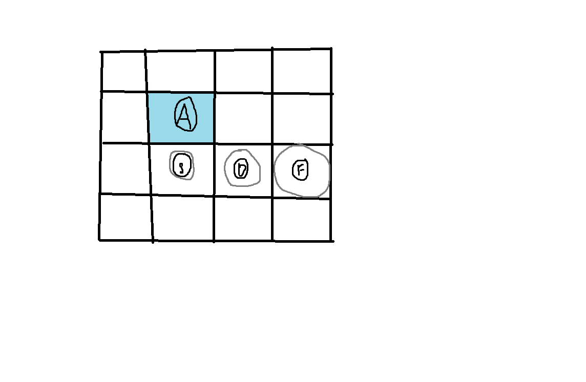

# Rhythmic Tiles

Author: Brad Zhang

Design: 4x4 grid with cursor, press the buttons in time with the music (visual prompt shows up as well)

Screen Shot:

How To Play:

arrow keys to move, press A/S/D/F when prompted. Must be on the correct tile, and press the correct key with correct timing, to score a point

Sources: (TODO: list a source URL for any assets you did not create yourself. Make sure you have a license for the asset.)

This game was built with [NEST](NEST.md).

